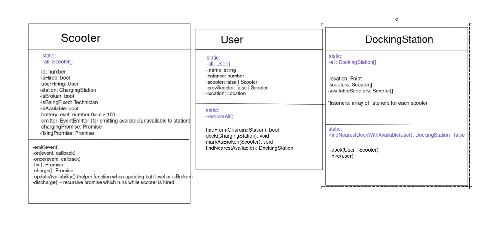
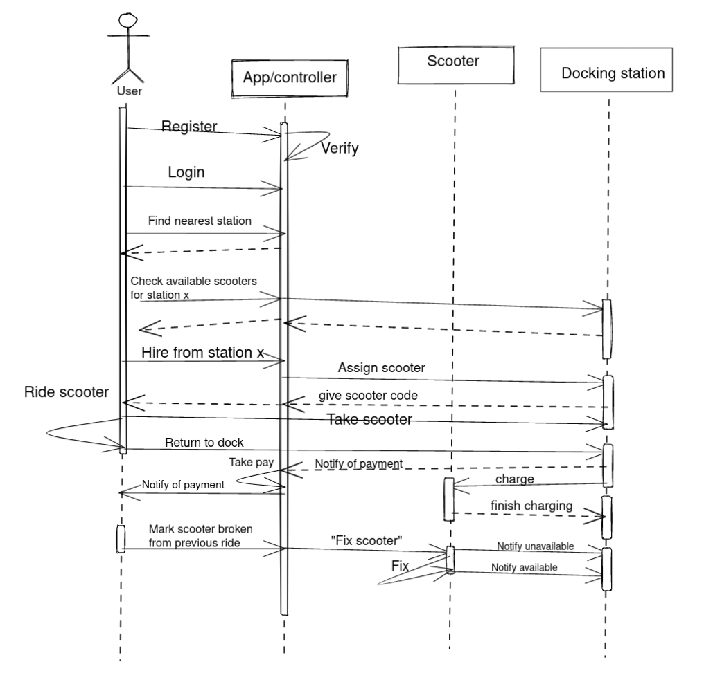
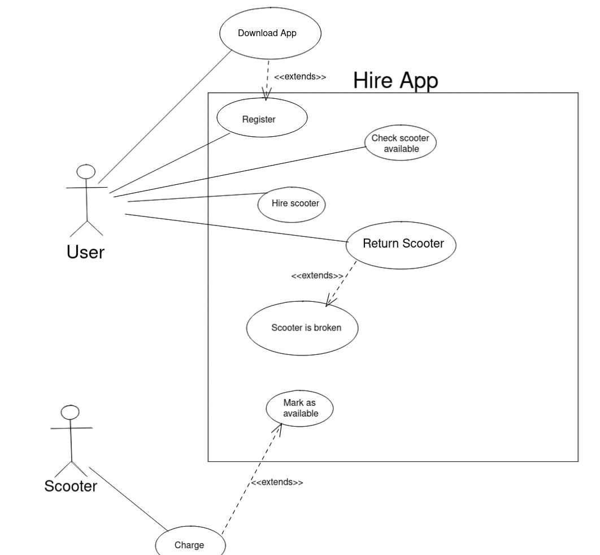

## Notes

### What went well:

- I think I used asynchronous JS nicely for the scooter charging and discharging functionality.
- I enjoyed using typescript and was able to see that it can be very helpful to code with
- TDD became very powerful and useful once I got it

### What didn't go well

- I probably should have created an "App" class which handles interactions between Users, Scooters, and Stations
- My tests could have been organised better
- Lack of documentation - JS-doc for next project?

---

## UML Diagrams

### Class

### Lifetime

### Class

